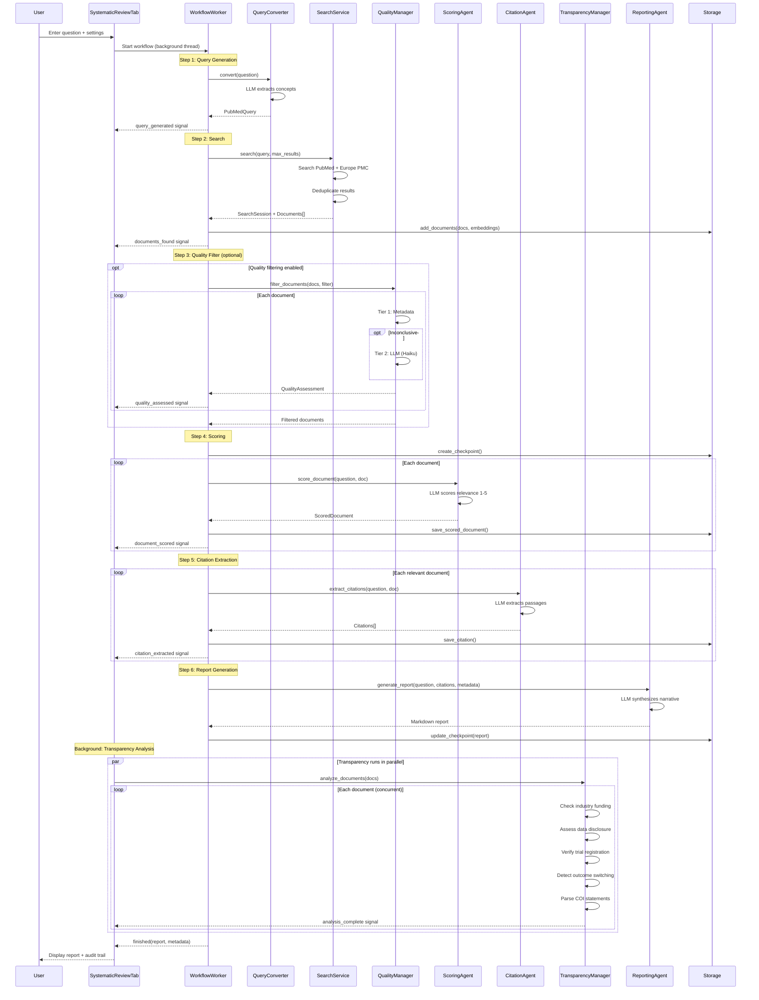
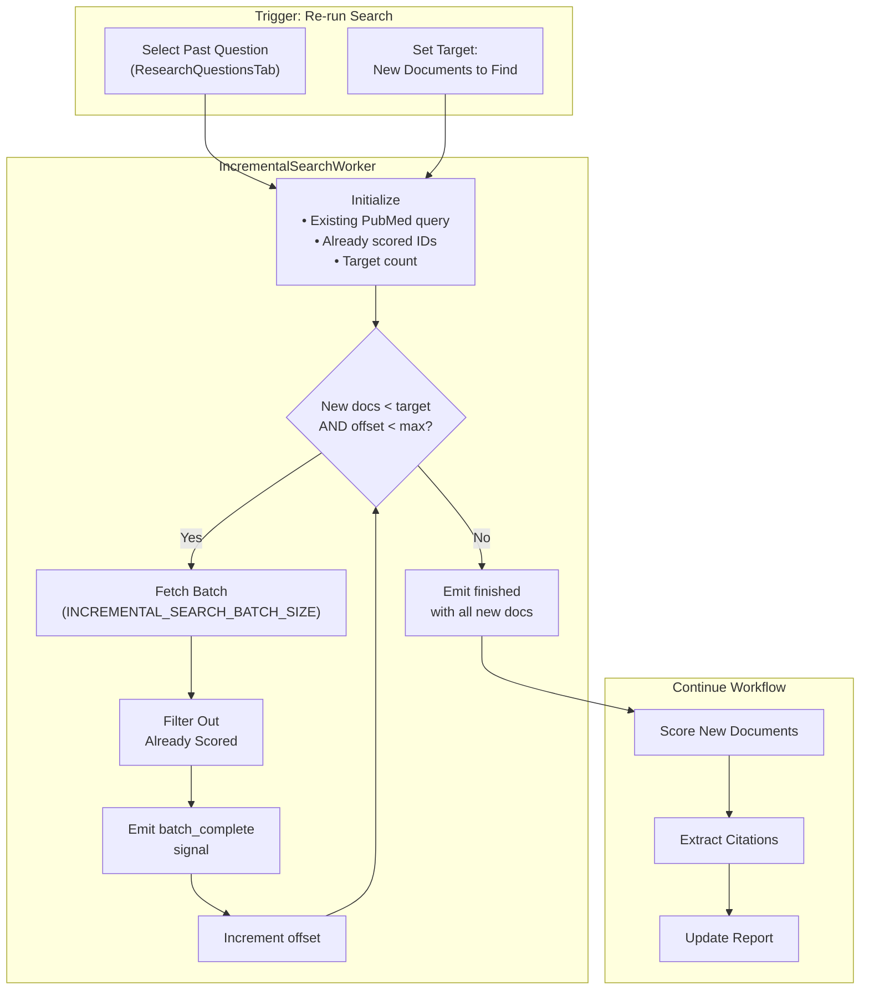
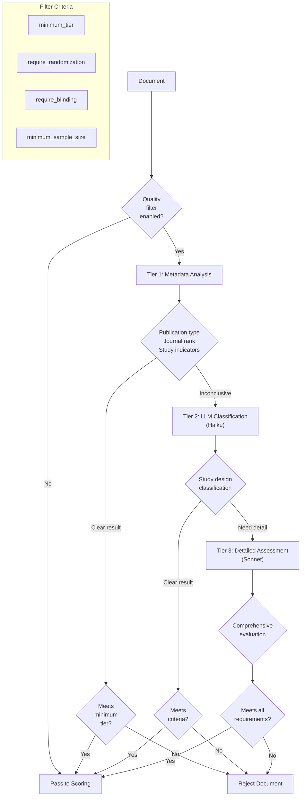
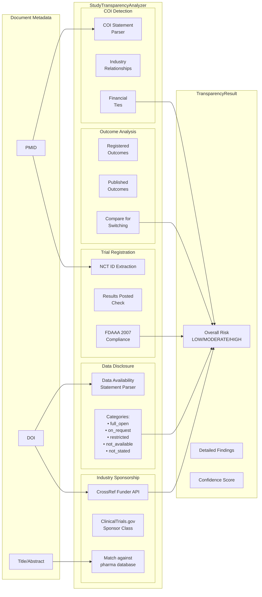
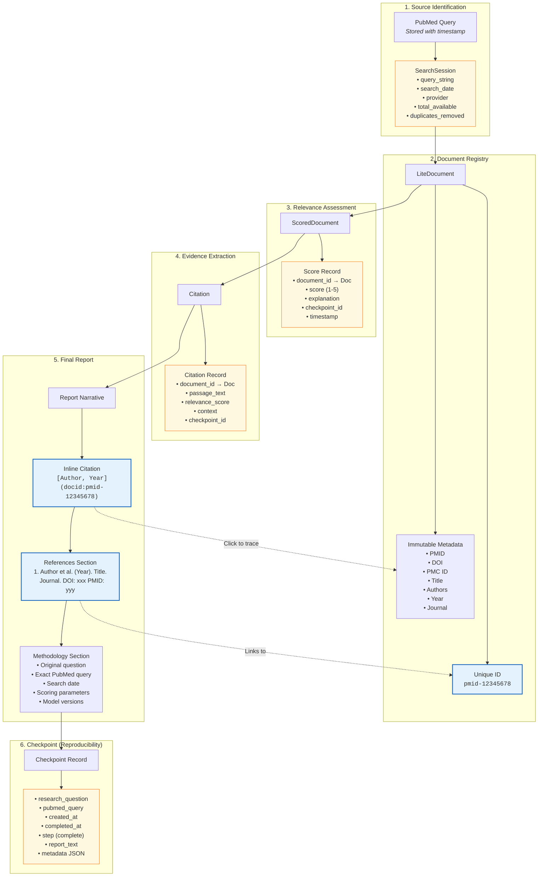
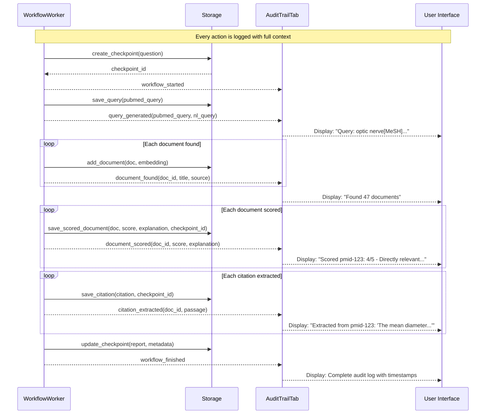
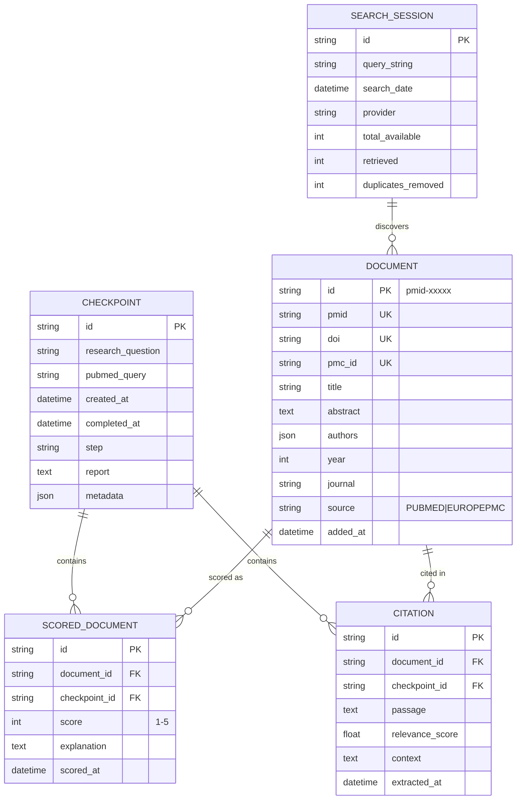

# Systematic Review Workflow

This document describes the complete workflow from user question input to final report generation, with emphasis on the **audit trail and reference provenance tracking** that ensures every claim in the final report can be traced back to its source.

## Key Design Principle: Full Provenance Chain

Every piece of evidence in the final report maintains a complete audit trail:

```
Research Question → PubMed Query → Document (PMID/DOI) → Score + Explanation → Extracted Passage → Report Citation
```

This chain is preserved in the database and exposed through real-time signals for transparency.

## Overview Diagram

```mermaid
flowchart TD
    subgraph UserInput["User Input"]
        Q[/"Research Question"/]
        Settings["Settings<br/>• Max results<br/>• Min score threshold<br/>• Quality filters<br/>• Transparency analysis"]
    end

    subgraph QueryGeneration["Step 1: Query Generation"]
        QC["LiteQueryConverter<br/>(LLM)"]
        QC -->|"Extract concepts"| Concepts["2-4 Key Concepts<br/>• MeSH terms<br/>• Keywords"]
        Concepts --> PubMedQ["PubMed Query String"]
        PubMedQ --> Fallback{Query valid?}
        Fallback -->|No| FallbackQ["Fallback Query<br/>(keyword extraction)"]
        Fallback -->|Yes| ValidQ["Valid Query"]
    end

    subgraph Search["Step 2: Literature Search"]
        SearchService["SearchService"]
        SearchService --> PubMed["PubMed API<br/>(E-utilities)"]
        SearchService --> EPMC["Europe PMC API<br/>(REST)"]
        PubMed --> Results1["Results Set 1"]
        EPMC --> Results2["Results Set 2"]
        Results1 --> Dedup["Deduplication<br/>(PMID/DOI/PMC/Title)"]
        Results2 --> Dedup
        Dedup --> Documents["LiteDocument[]<br/>+ Embeddings"]
    end

    subgraph OptionalIncremental["Optional: Iterative Result Fetching"]
        IncrSearch["IncrementalSearchWorker"]
        IncrSearch -->|"Batch fetch"| MoreResults["Fetch More Results<br/>(offset pagination)"]
        MoreResults --> FilterScored["Filter Already Scored"]
        FilterScored -->|"Target not met"| IncrSearch
        FilterScored -->|"Target met or exhausted"| NewDocs["New Documents"]
    end

    subgraph QualityFilter["Step 3: Quality Filtering (Optional)"]
        QM["QualityManager"]
        QM --> Tier1["Tier 1: Metadata Filter<br/>(free, instant)"]
        Tier1 -->|"Inconclusive"| Tier2["Tier 2: LLM Classification<br/>(Haiku - fast)"]
        Tier2 -->|"Need detail"| Tier3["Tier 3: Detailed Assessment<br/>(Sonnet)"]
        Tier1 --> Filtered["Filtered Documents"]
        Tier2 --> Filtered
        Tier3 --> Filtered
    end

    subgraph Scoring["Step 4: Document Scoring"]
        SA["LiteScoringAgent<br/>(LLM)"]
        SA -->|"Per document"| Score["Score 1-5<br/>+ Explanation"]
        Score --> Persist1[("Save to DB<br/>(crash-safe)")]
        Score --> FilterMin{"Score ≥<br/>threshold?"}
        FilterMin -->|Yes| Relevant["Relevant Documents"]
        FilterMin -->|No| Rejected["Rejected"]
    end

    subgraph Citation["Step 5: Citation Extraction"]
        CA["LiteCitationAgent<br/>(LLM)"]
        CA -->|"Per document"| Extract["Extract 1-3<br/>Key Passages"]
        Extract --> Citations["Citations[]<br/>• passage text<br/>• relevance score<br/>• context"]
        Citations --> Persist2[("Save to DB")]
    end

    subgraph Transparency["Step 6: Transparency Analysis (Background)"]
        TM["TransparencyManager"]
        TM --> Industry["Industry Sponsorship<br/>(CrossRef, ClinicalTrials.gov)"]
        TM --> DataDisc["Data Disclosure<br/>(availability statements)"]
        TM --> TrialReg["Trial Registration<br/>(FDAAA compliance)"]
        TM --> Outcome["Outcome Reporting<br/>(switching detection)"]
        TM --> COI["COI Analysis<br/>(financial ties)"]
        Industry --> Risk["Risk Assessment<br/>LOW/MODERATE/HIGH"]
        DataDisc --> Risk
        TrialReg --> Risk
        Outcome --> Risk
        COI --> Risk
    end

    subgraph Report["Step 7: Report Generation"]
        RA["LiteReportingAgent<br/>(LLM)"]
        RA --> Narrative["Synthesized Narrative<br/>• Thematic organization<br/>• Inline citations<br/>• Conflicting evidence"]
        Narrative --> Refs["References Section<br/>(numbered bibliography)"]
        Refs --> Method["Methodology Section<br/>• Search parameters<br/>• Score distribution<br/>• Models used<br/>• Timestamps"]
        Method --> FinalReport["Final Markdown Report"]
    end

    subgraph Output["Output"]
        Display["Report Tab Display"]
        Checkpoint[("Checkpoint<br/>+ Reproducibility<br/>Metadata")]
        AuditTrail["Audit Trail<br/>(real-time signals)"]
    end

    %% Main flow connections
    Q --> QC
    Settings --> SearchService
    ValidQ --> SearchService
    FallbackQ --> SearchService
    Documents --> QM
    Documents --> SA
    NewDocs --> SA
    Filtered --> SA
    Relevant --> CA
    Citations --> RA
    Risk -.->|"Enriches"| FinalReport
    FinalReport --> Display
    FinalReport --> Checkpoint

    %% Signal flow (dashed)
    QC -.->|"query_generated"| AuditTrail
    Documents -.->|"documents_found"| AuditTrail
    Score -.->|"document_scored"| AuditTrail
    Citations -.->|"citation_extracted"| AuditTrail
    Risk -.->|"analysis_complete"| AuditTrail

    %% Styling
    classDef llm fill:#e1f5fe,stroke:#01579b
    classDef storage fill:#fff3e0,stroke:#e65100
    classDef optional fill:#f3e5f5,stroke:#7b1fa2
    classDef input fill:#e8f5e9,stroke:#2e7d32
    classDef output fill:#fce4ec,stroke:#c2185b

    class QC,SA,CA,RA,Tier2,Tier3 llm
    class Persist1,Persist2,Checkpoint storage
    class OptionalIncremental,QualityFilter,Transparency optional
    class Q,Settings input
    class Display,FinalReport,AuditTrail output
```



## Detailed Component Interactions



## Iterative Result Fetching Flow



## Quality Filter Decision Tree



## Transparency Analysis Components



## Audit Trail & Reference Provenance

The system maintains complete traceability from every claim in the final report back to its original source document. This is critical for scientific reproducibility and verification.

### Provenance Chain Diagram



### Citation Format in Reports

The report uses a special citation format that preserves document traceability:

```markdown
According to Smith et al., the treatment showed significant improvement
in patient outcomes [Smith, 2023](docid:pmid-12345678), which was
corroborated by a larger trial [Jones, 2024](docid:pmid-87654321).
```

The `docid:` prefix creates clickable links that navigate to the source document, allowing readers to:
1. View the original abstract
2. See the relevance score and explanation
3. Access the extracted passages
4. Link to PubMed/DOI for full text

### Audit Trail Signals

Real-time signals provide visibility into every step:



### Database Schema for Provenance



### Methodology Section Auto-Generation

The final report includes a comprehensive methodology section that documents exactly how the review was conducted:

```markdown
## Methodology

### Search Strategy
- **Research Question:** What is the efficacy of drug X for condition Y?
- **PubMed Query:** `"drug X"[MeSH] AND "condition Y"[MeSH] AND hasabstract`
- **Search Date:** 2024-01-15 14:32:07 UTC
- **Databases:** PubMed, Europe PMC (deduplicated)

### Results
- **Total Available:** 1,247 articles
- **Retrieved:** 100 articles
- **After Deduplication:** 98 unique articles
- **Quality Filtered:** 72 articles (RCTs and systematic reviews only)

### Relevance Scoring
- **Scoring Threshold:** ≥ 3/5
- **Accepted:** 34 articles
- **Rejected:** 64 articles

| Score | Count | Percentage |
|-------|-------|------------|
| 5     | 8     | 8.2%       |
| 4     | 12    | 12.2%      |
| 3     | 14    | 14.3%      |
| 2     | 28    | 28.6%      |
| 1     | 36    | 36.7%      |

### AI Models Used
| Task | Provider | Model | Temperature |
|------|----------|-------|-------------|
| Query Conversion | Anthropic | claude-3-haiku | 0.1 |
| Document Scoring | Anthropic | claude-3-haiku | 0.1 |
| Citation Extraction | Anthropic | claude-3-haiku | 0.1 |
| Report Generation | Anthropic | claude-3-sonnet | 0.3 |

### Citations
- **Total Passages Extracted:** 87
- **From Unique Documents:** 34

---
*Generated: 2024-01-15 14:45:23 UTC*
*BMLibrarian Lite v1.2.0*
```

### Traceability Features

| Feature | Purpose | Implementation |
|---------|---------|----------------|
| **Document IDs** | Unique identification | `pmid-{pmid}` or `doi-{doi}` format |
| **Inline Citations** | Click-to-source in report | `[Author, Year](docid:ID)` markdown links |
| **Checkpoint System** | Reproducibility | Full state saved at each workflow completion |
| **Real-time Signals** | Live audit trail | Qt signals to AuditTrailTab |
| **Methodology Section** | Search documentation | Auto-generated with exact parameters |
| **Score Explanations** | Decision transparency | LLM explains each relevance judgment |
| **Crash Recovery** | No lost work | Per-document persistence to SQLite |
